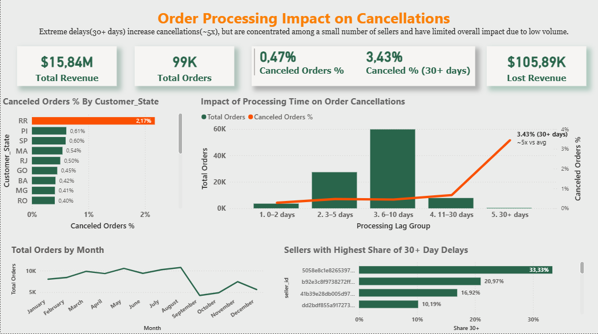

# Order Processing Impact on Cancellations

## 🔍 Summary
Extreme processing delays (30+ days) increase cancellation rates by ~5x, but are driven by a small number of sellers and have limited overall impact due to low volume.

---

## 📊 Dashboard

---

## 📁 Dataset
Olist E-commerce Dataset

Includes:
- Orders
- Customers
- Sellers
- Order items

---

## 🔑 Key Insights

- Orders with processing time above 30 days show significantly higher cancellation rates
- These extreme delays represent a very small share of total orders
- A small number of sellers account for a disproportionately high share of 30+ day delays (up to 30% vs ~0.2% average)
- Most revenue is generated within the 6–10 day processing window, where cancellation rates remain stable

---

## 🧠 Approach

- Data cleaning and transformation in Power BI
- Data modeling (fact and dimension tables)
- DAX measures for KPIs and analysis
- Segment-level analysis (state, seller, processing time)

---

## 🛠 Tools Used

- Power BI  
- DAX  
- Data Modeling  

---

## 📌 Key Takeaway

Not all operational issues have equal business impact. While extreme delays significantly increase cancellations, they are concentrated among a small number of sellers and do not drive the majority of revenue loss.
